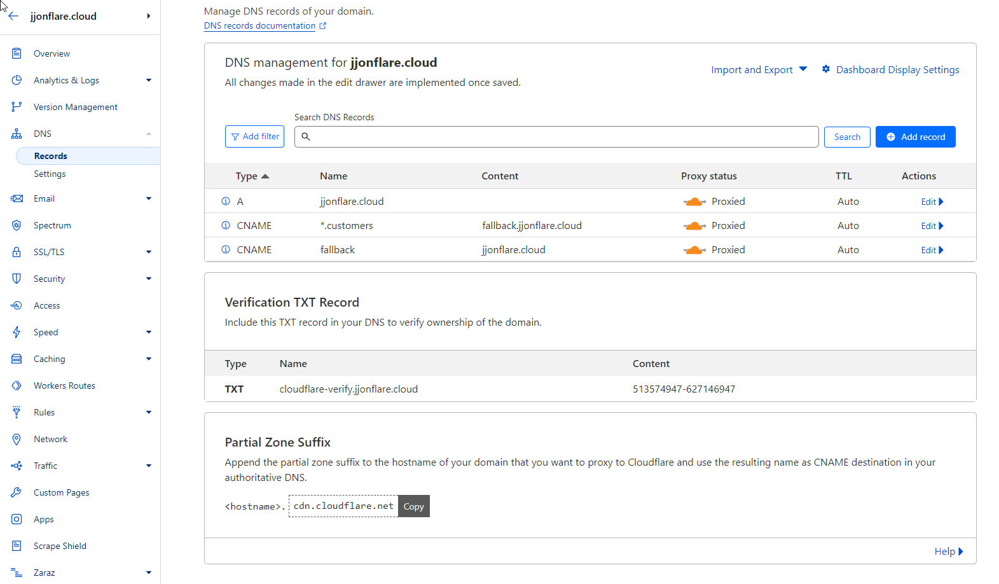
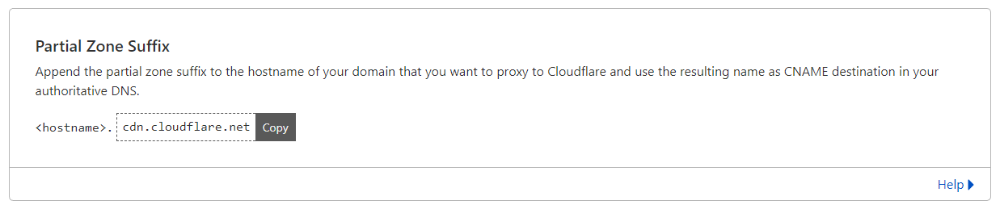
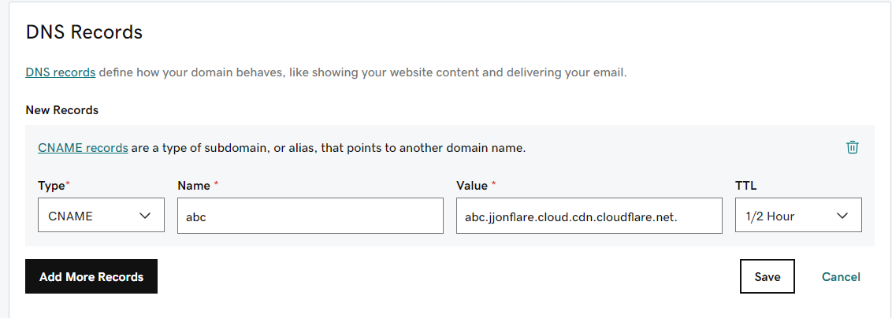
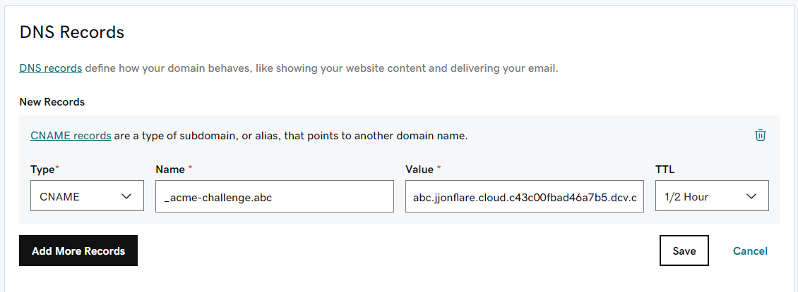
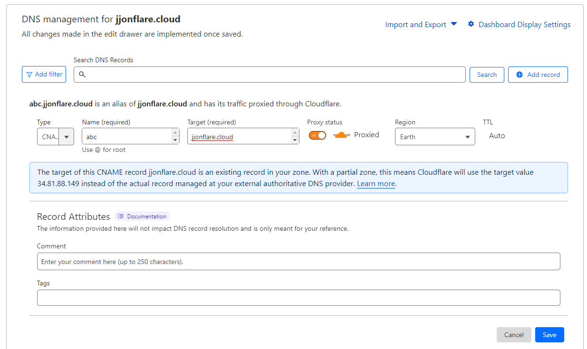
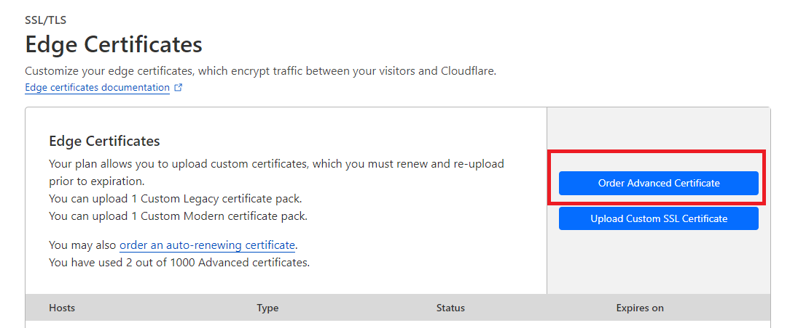
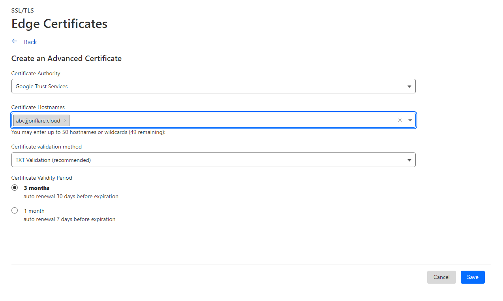
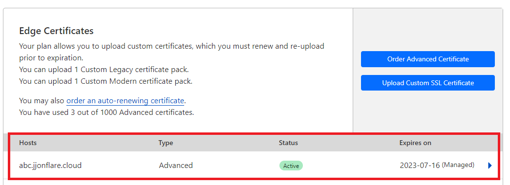

# DCV Delegation for Partial Zones

## DNS > Record (CNAME Setup)




If you want to host a website name ```abc.jjonflare.cloud``` you need to create a partial Zone suffix in your authoritative DNS provider.

It will look like ```abc.jjonflare.cloud.cdn.cloudflare.net```

**Example on Godaddy DNS**





Next create CNAME record in your DNS provider for DCV delegation


**Example on Godaddy DNS**

_acme-challenge.abc abc.jjonflare.cloud.c43c00fbad46a7b5.dcv.cloudflare.com.



**On Cloudflare Dashboard**

Next add the CNAME record on Cloudflare dashboard ```abc.jjonflare.cloud```



**Edge Certificate**

Navigate to SSL/TLS > Edge Certificate, order advanced certificate
For this example I selected **Google Trust Services** as Cloudflare will stop using **DigiCert** as an issuing certificate authority (CA) [More info here](https://developers.cloudflare.com/ssl/reference/migration-guides/digicert-update/advanced-certificates/)





And finally the certificate is issued on Cloudflare

